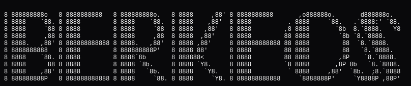
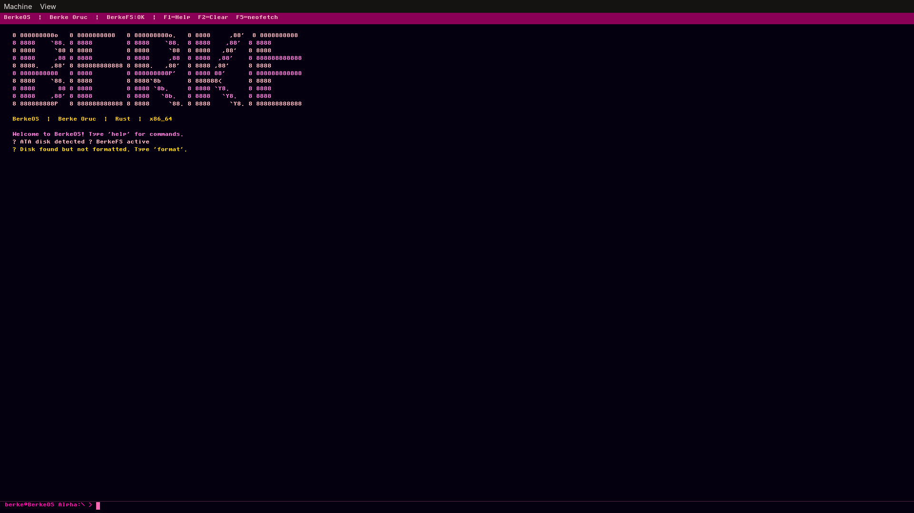
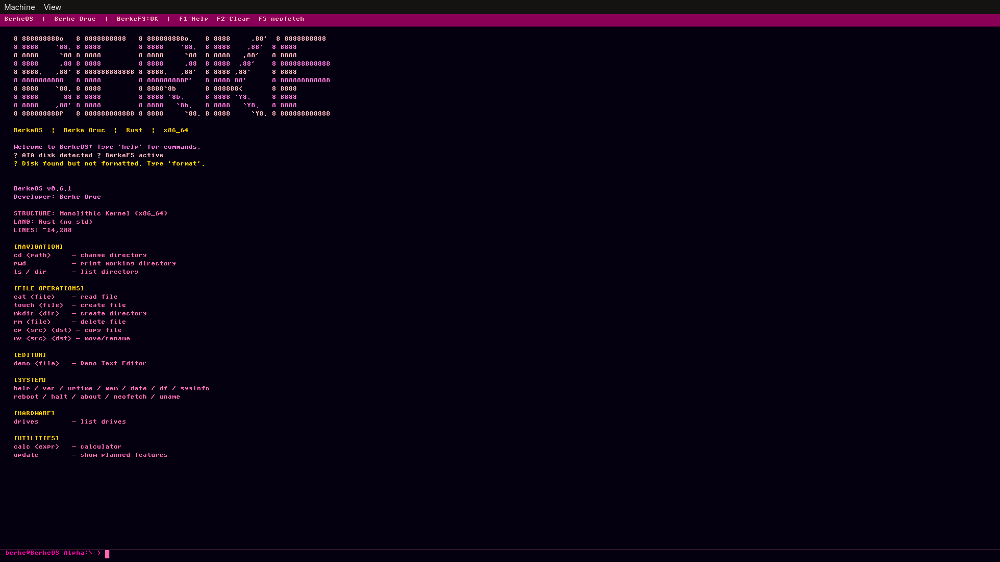
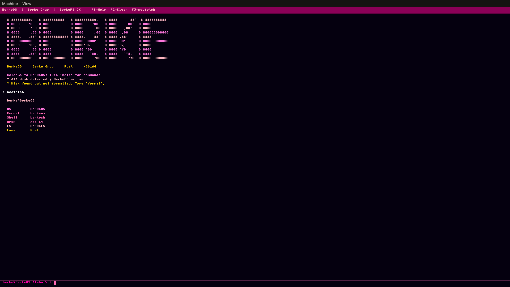
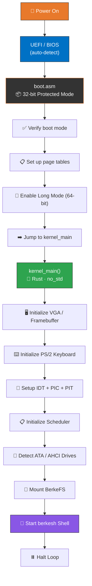

<div align="center">

<!-- ═══════════════════════════════════════════════════════════════════════ -->
<!--                          HERO BANNER SECTION                          -->
<!-- ═══════════════════════════════════════════════════════════════════════ -->



<br/>

<!-- Animated Typing SVG -->
<a href="https://github.com/berkeoruc/berkeos">
  
</a>

<br/>

<!-- Primary Badges Row -->
[](https://www.rust-lang.org/)
[](#architecture)
[](LICENSE)
[](#changelog)
[](#code-statistics)

<br/>

<!-- Secondary Badges Row -->
[](https://github.com/berkeoruc/berkeos/stargazers)
[](https://github.com/berkeoruc/berkeos/network)
[](https://github.com/berkeoruc/berkeos/issues)
[](https://github.com/berkeoruc/berkeos/commits)

<br/>

<!-- Tagline -->
> **🇹🇷 Built from scratch by a 16-year-old developer from Turkey**
> 
> *A modern, DOS-inspired operating system proving that with dedication and AI assistance, anyone can build an OS.*

<br/>

<!-- Quick Links -->
[](#-quick-start)&nbsp;&nbsp;
[](#-architecture)&nbsp;&nbsp;
[](#-roadmap)&nbsp;&nbsp;
[](#-contributing)

</div>


<!-- ═══════════════════════════════════════════════════════════════════════ -->
<!--                        TABLE OF CONTENTS                              -->
<!-- ═══════════════════════════════════════════════════════════════════════ -->

## 📑 Table of Contents

<details open>
<summary><b>Click to expand/collapse</b></summary>

```
  ─────────────────────────────────────────────
    🎯 About the Project                      
    👨‍💻 About the Developer                  
    📸 Screenshots                           
    ✅ Module Status                         
    🛠️ Features                             
    📊 Code Statistics                       
    🚀 Quick Start                           
    🏗️ Architecture                          
    💻 Shell Commands                        
    🗺️ Roadmap                              
    📜 Changelog                            
    🤝 Contributing                         
    📄 License                              
    🙏 Acknowledgments                       
  ─────────────────────────────────────────────
  ```

</details>


<!-- ═══════════════════════════════════════════════════════════════════════ -->
<!--                         ABOUT THE PROJECT                             -->
<!-- ═══════════════════════════════════════════════════════════════════════ -->

## 🎯 About the Project

<div align="center">

```
__/\\\\\\\\\\\\\___________________________________________________________________/\\\\\__________/\\\\\\\\\\\___        
 _\/\\\/////////\\\_______________________________/\\\____________________________/\\\///\\\______/\\\/////////\\\_       
  _\/\\\_______\/\\\______________________________\/\\\__________________________/\\\/__\///\\\___\//\\\______\///__      
   _\/\\\\\\\\\\\\\\______/\\\\\\\\___/\\/\\\\\\\__\/\\\\\\\\________/\\\\\\\\___/\\\______\//\\\___\////\\\_________     
    _\/\\\/////////\\\___/\\\/////\\\_\/\\\/////\\\_\/\\\////\\\____/\\\/////\\\_\/\\\_______\/\\\______\////\\\______    
     _\/\\\_______\/\\\__/\\\\\\\\\\\__\/\\\___\///__\/\\\\\\\\/____/\\\\\\\\\\\__\//\\\______/\\\__________\////\\\___   
      _\/\\\_______\/\\\_\//\\///////___\/\\\_________\/\\\///\\\___\//\\///////____\///\\\__/\\\_____/\\\______\//\\\__  
       _\/\\\\\\\\\\\\\/___\//\\\\\\\\\\_\/\\\_________\/\\\_\///\\\__\//\\\\\\\\\\____\///\\\\\/_____\///\\\\\\\\\\\/___ 
        _\/////////////______\//////////__\///__________\///____\///____\//////////_______\/////_________\///////////_____
```

</div>

**BerkeOS** is a modern, DOS-inspired operating system developed entirely from scratch using Rust (`no_std`). It features a complete boot chain, monolithic kernel, custom filesystem, interactive shell, device drivers, and more — all built with zero budget using free AI tools.

<table>
<tr>
<td width="50%">

### 🔑 Key Highlights

- 🦀 **Pure Rust** — `no_std` monolithic kernel
- 🖥️ **Bare Metal** — Boots on real x86_64 hardware
- 📁 **Custom FS** — BerkeFS with ATA PIO support
- 🐚 **Rich Shell** — `berkesh` with 30+ commands
- ✏️ **Text Editor** — Built-in `deno` editor
- 🎵 **Audio** — PC Speaker beep & melodies
- ⏰ **Real-Time** — RTC clock integration
- 🔒 **Memory Safe** — Rust's ownership model

</td>
<td width="50%">

### 📈 Project Stats

| Metric | Value |
|:---|:---|
| 🏗️ Architecture | `x86_64` (Long Mode) |
| 🦀 Language | Rust (nightly, `no_std`) |
| 🔧 Assembler | NASM (boot stage) |
| 📦 Build System | Custom (Cargo + NASM + LD + GRUB) |
| 🖥️ Emulator | QEMU |
| 📏 Total Lines | ~14,288 |
| 💰 Build Cost | **0 TL** |
| 📅 Started | 2024 (developer age 14) |

</td>
</tr>
</table>


<!-- ═══════════════════════════════════════════════════════════════════════ -->
<!--                        ABOUT THE DEVELOPER                            -->
<!-- ═══════════════════════════════════════════════════════════════════════ -->

## 👨‍💻 About the Developer

<div align="center">

<table>
<tr>
<td align="center" width="200px">
  <br/>
  
  <br/><br/>
  <b>Berke Oruç</b>
  <br/>
  <sub>Age 16 · Turkey 🇹🇷</sub>
  <br/><br/>
  <a href="https://github.com/berkeoruc">
    
  </a>
</td>
<td>

> *"I wanted to prove that with dedication and AI assistance, anyone can build an operating system from scratch."*

| Detail | Info |
|:---|:---|
| 🎂 **Age** | 16 years old |
| 🌍 **Location** | Turkey 🇹🇷 |
| 🚀 **Started** | Age 8 (2018) with js |
| 🎯 **Motivation** | Proving OS development is accessible to anyone |
| 💰 **Cost** | 0 TL — built entirely with free AI tools |
| 🤖 **AI Tools** | Free AI assistants for code generation & learning |

</td>
</tr>
</table>

</div>


> It is an ambitious project aiming for broad compatibility (including Linux ABI support) and a flexible architecture. We consider it a sister project, and your support there would be highly valued!
<!-- ═══════════════════════════════════════════════════════════════════════ -->
<!--                           SCREENSHOTS                                 -->
<!-- ═══════════════════════════════════════════════════════════════════════ -->

## 📸 Screenshots

<div align="center">

> ⚠️ **Note:** Some of the screenshots may not be uploaded yet.

<table>
<tr>
<td align="center" width="50%">

<br/><sub><b>🖥️ Boot Screen</b> — UEFI/BIOS auto-detection</sub>
</td>
<td align="center" width="50%">

<br/><sub><b>🐚 berkesh Shell</b> — Interactive command line</sub>
</td>
</tr>
<tr>
<td align="center" width="50%">

<br/><sub><b>📊 Neofetch</b> — System information</sub>
</td>
<td align="center" width="50%">

<br/><sub><b>✏️ Deno Editor</b> — Built-in text editor</sub>
</td>
</tr>
</table>

</div>


<!-- ═══════════════════════════════════════════════════════════════════════ -->
<!--                         MODULE STATUS TABLE                           -->
<!-- ═══════════════════════════════════════════════════════════════════════ -->

## ✅ Module Status

> **Transparency Note:** This table reflects the *actual implementation status* as derived from the source code.

<div align="center">

| Module | Source File(s) | Status | Description |
|:---|:---|:---:|:---|
| 🟢 **Boot Chain** | `boot.asm`, `linker.ld` | ✅ | 32→64 bit Long Mode, page tables, kernel jump |
| 🟢 **VGA Text Mode** | `vga.rs` | ✅ | 80×25 color text output, scrolling |
| 🟢 **Framebuffer** | `framebuffer.rs`, `font.rs` | ✅ | Graphical framebuffer, font rendering |
| 🟢 **IDT + PIC + PIT** | `idt.rs`, `pic.rs`, `pit.rs` | ✅ | Interrupts, 8259 PIC, 100Hz timer |
| 🟢 **PS/2 Keyboard** | `keyboard.rs` | ✅ | Scan code → keypress, layout support |
| 🟢 **Memory Paging** | `paging.rs`, `allocator.rs` | ✅ | 2 MiB huge pages, heap allocator |
| 🟢 **ATA PIO Disk** | `ata.rs` | ✅ | Read/write sectors, disk detection |
| 🟢 **BerkeFS** | `berkefs.rs` | ✅ | Custom filesystem, dirs, files, mount |
| 🟢 **Shell (berkesh)** | `shell.rs` | ✅ | 30+ commands, history, tab support |
| 🟢 **Deno Editor** | `deno.rs`, `editor.rs` | ✅ | Built-in text editor |
| 🟢 **RTC Clock** | `rtc.rs` | ✅ | Real-time clock, date/time |
| 🟢 **PC Speaker** | `pcspeaker.rs`, `audio.rs` | ✅ | Beep, melodies via PIT |
| 🟢 **Scheduler** | `scheduler.rs`, `process.rs` | ✅ | Basic process scheduling |
| 🟢 **Syscalls** | `syscall.rs` | ✅ | System call interface |
| 🟡 **AHCI/SATA** | `ahci.rs` | 🧪 | SATA controller detection, WIP |
| 🟡 **USB Stack** | `usb/` | 🧪 | OHCI, USB storage — early stage |
| 🟡 **Network** | `net/`, `rtl8139.rs` | 🧪 | IPv4/ARP buffers, RTL8139 — early stage |

</div>

> **Legend:** 🟢 **Implemented** | 🟡 **Experimental** | 🔴 **Planned**


<!-- ═══════════════════════════════════════════════════════════════════════ -->
<!--                            FEATURES                                   -->
<!-- ═══════════════════════════════════════════════════════════════════════ -->

## 🛠️ Features

### 🧠 Kernel & Boot
- ✅ Monolithic kernel in Rust (`no_std`, `#![no_main]`)
- ✅ UEFI/BIOS auto-detection boot
- ✅ `boot.asm` — 32-bit → Long Mode transition
- ✅ Page tables with 2 MiB huge pages
- ✅ Heap allocator
- ✅ IDT + PIC 8259 + PIT 100Hz timer
- ✅ Basic process scheduler & syscall interface

### 📁 Filesystem & Storage
- ✅ BerkeFS — custom filesystem (up to 12 drives)
- ✅ ATA PIO disk read/write
- ✅ Directory tree, file ops (create, read, write, delete)
- ✅ Drive mount/unmount/format
- 🧪 AHCI SATA controller detection (experimental)

### 🐚 Shell & User Interface
- ✅ `berkesh` — interactive CLI with 30+ commands
- ✅ VGA text mode with color support (80×25)
- ✅ Framebuffer graphics mode with font rendering
- ✅ `deno` — built-in text editor
- ✅ Calculator, neofetch, system info
- ✅ Command history

### 🔌 Device Drivers
- ✅ PS/2 keyboard with scan code translation
- ✅ RTC (Real-Time Clock)
- ✅ PC Speaker (beep, play melodies)
- 🧪 RTL8139 network card driver (experimental)
- 🧪 USB OHCI + mass storage (experimental)


<!-- ═══════════════════════════════════════════════════════════════════════ -->
<!--                         CODE STATISTICS                               -->
<!-- ═══════════════════════════════════════════════════════════════════════ -->

## 📊 Code Statistics

<div align="center">

```
      ─────────────────────────────────────────────────────
             CODE AUTHORSHIP BREAKDOWN                    
      ─────────────────────────────────────────────────────
      
        Developer Written    ████████████░░░░░  43%       
        AI-Assisted          ████████████████░  57%      
      
        Total Lines: ~14,288                           
        By Developer: ~6,143 lines                      
        AI-Assisted: ~8,145 lines                      
        Build Cost: 0 TL                                
      
      ─────────────────────────────────────────────────────
```

</div>


<!-- ═══════════════════════════════════════════════════════════════════════ -->
<!--                           QUICK START                                 -->
<!-- ═══════════════════════════════════════════════════════════════════════ -->

## 🚀 Quick Start

### 📋 Prerequisites

```bash
# Arch Linux
sudo pacman -S rust nasm grub xorriso qemu
rustup override set nightly
rustup component add rust-src llvm-tools-preview

# Ubuntu / Debian
sudo apt install build-essential rustc nasm grub-pc-bin xorriso qemu-system-x86
rustup override set nightly
rustup component add rust-src llvm-tools-preview
```

### ⚡ Build & Run

```bash
# 1️⃣  Clone the repository
git clone https://github.com/berkeoruc/berkeos.git
cd berkeos

# 2️⃣  Build the OS (creates bootable ISO)
chmod +x build.sh
./build.sh

# 3️⃣  Run in QEMU
chmod +x run.sh
./run.sh

# UEFI mode
./run.sh --uefi
```

### 🔧 Build Process

```
build.sh Pipeline
─────────────────
  1. NASM compiles boot.asm → boot.o (32-bit bootstrap)
  2. Cargo builds kernel as staticlib (x86_64-unknown-none)
  3. ld links boot.o + libkernelos.a → kernel.bin
  4. grub-mkrescue packages into bootable ISO
```


<!-- ═══════════════════════════════════════════════════════════════════════ -->
<!--                          ARCHITECTURE                                 -->
<!-- ═══════════════════════════════════════════════════════════════════════ -->

## 🏗️ Architecture

### Boot Flow Diagram



### Project Structure

```
BerkeOS/
│
├── 📄 Cargo.toml                 # Rust project config
├── 📄 linker.ld                  # Linker script
├── 🔧 build.sh                   # Build pipeline
├── 🔧 run.sh                     # QEMU launch
│
├── 📂 assets/                    # Images, screenshots
│
└── 📂 src/
    ├── boot.asm                  # NASM bootstrap
    ├── main.rs                   # Cargo dummy entry
    ├── lib.rs                    # kernel_main + modules
    │
    ├── idt.rs, pic.rs, pit.rs   # Interrupts
    ├── paging.rs, allocator.rs   # Memory
    ├── scheduler.rs, process.rs   # Process management
    ├── syscall.rs                # System calls
    │
    ├── vga.rs, framebuffer.rs   # Graphics
    ├── keyboard.rs, ata.rs       # Drivers
    ├── rtc.rs, pcspeaker.rs     # Peripherals
    │
    ├── berkefs.rs                # Filesystem
    ├── shell.rs                  # Shell
    ├── deno.rs, editor.rs       # Editor
    │
    ├── usb/                      # USB stack 🧪
    └── net/                      # Network 🧪
```


<!-- ═══════════════════════════════════════════════════════════════════════ -->
<!--                         SHELL COMMANDS                                -->
<!-- ═══════════════════════════════════════════════════════════════════════ -->

## 💻 Shell Commands

### Navigation
| Command | Description |
|:---|:---|
| `cd <dir>` | Change directory |
| `pwd` | Print working directory |
| `ls` / `dir` | List directory contents |
| `drives` | List available drives |
| `df` | Disk free space |

### File Operations
| Command | Description |
|:---|:---|
| `cat <file>` | Display file contents |
| `touch <file>` | Create empty file |
| `mkdir <dir>` | Create directory |
| `rm <path>` | Remove file or directory |
| `cp <src> <dst>` | Copy file |
| `mv <src> <dst>` | Move/rename file |
| `find <name>` | Search for files |
| `stat <path>` | File/dir information |

### System
| Command | Description |
|:---|:---|
| `help` | Show available commands |
| `ver` | Version info |
| `date` | Current date/time (RTC) |
| `mem` | Memory usage |
| `sysinfo` | Full system information |
| `neofetch` | System info display |
| `uptime` | System uptime |

### Tools & Admin
| Command | Description |
|:---|:---|
| `calc <expr>` | Calculator |
| `beep` | PC Speaker beep |
| `play <melody>` | Play melody |
| `deno <file>` | Open text editor |
| `format <drv>` | Format a drive |
| `fsck` | Filesystem check |
| `reboot` | Reboot system |
| `halt` | Halt / shutdown |


<!-- ═══════════════════════════════════════════════════════════════════════ -->
<!--                            ROADMAP                                    -->
<!-- ═══════════════════════════════════════════════════════════════════════ -->

## 🗺️ Roadmap

| Version | Goals |
|:---|:---|
| **v0.7** | Stability & Polish |
| **v0.8** | BerkeFS v2, Shell UX, Drive Registry |
| **v0.9** | TCP/IP, Sound Card, USB Stabilization |
| **v1.0** | SMP, GUI Desktop, Package Manager |

### v0.7 Priorities

| # | Task | Impact |
|:---:|:---|:---:|
| 1 | Version Consistency | 🟢 High |
| 2 | CI/CD Pipeline | 🟢 High |
| 3 | Panic Handler Improvements | 🟢 High |
| 4 | First GitHub Release | 🟢 High |


<!-- ═══════════════════════════════════════════════════════════════════════ -->
<!--                        CHANGELOG                                     -->
<!-- ═══════════════════════════════════════════════════════════════════════ -->

## 📜 Changelog

### v0.6.3 — Stabilization
> **Date: March 2026**

| Change | Description |
|:---|:---|
| 🔌 **Serial Port** | COM1 driver (115200 8N1) added |
| 📝 **Log Macros** | kinfo!, kwarn!, kerr!, kdebug! |
| 🚨 **Panic Handler** | Serial output + stack dump |
| 🗂️ **DriveRegistry** | FS0..FS11 → single struct |
| ✅ **fsck** | BerkeFS validation tool |
| 🤖 **CI/CD** | GitHub Actions pipeline |
| 📦 **Test Harness** | Automated test script |

### v0.6.2 — UI/UX & Code Quality
> **Date: March 2026**

- ASCII logo added
- All Unicode boxes translated to English
- Silent boot (GRUB timeout = 0)
- Global state refactor (static mut → spin::Mutex)

### v0.6.1 — Stability Patch
> Bug fixes and minor improvements

### v0.6.0 — Initial Release
> First public release with core functionality


<!-- ═══════════════════════════════════════════════════════════════════════ -->
<!--                          CONTRIBUTING                                 -->
<!-- ═══════════════════════════════════════════════════════════════════════ -->

## 🤝 Contributing

<div align="center">

[](http://makeapullrequest.com)
[](https://github.com/berkeoruc/berkeos/issues)

</div>

```bash
# 1️⃣  Fork the repository
# 2️⃣  Create your feature branch
git checkout -b feature/amazing-feature

# 3️⃣  Make your changes and commit
git commit -m "feat: add amazing feature"

# 4️⃣  Push to your fork
git push origin feature/amazing-feature

# 5️⃣  Open a Pull Request 🎉
```

### 🎯 Good First Issues

- 📝 Improve inline documentation
- 🧪 Test modules in QEMU and report bugs
- 📸 Take screenshots and add them to `assets/`


<!-- ═══════════════════════════════════════════════════════════════════════ -->
<!--                            LICENSE                                    -->
<!-- ═══════════════════════════════════════════════════════════════════════ -->

## 📄 License

Apache License 2.0 — Copyright 2024-2026 Berke Oruç


<!-- ═══════════════════════════════════════════════════════════════════════ -->
<!--                        ACKNOWLEDGMENTS                                -->
<!-- ═══════════════════════════════════════════════════════════════════════ -->

## 🙏 Acknowledgments

- **Rust Community** — `no_std` ecosystem
- **OSDev Wiki** — Kernel development resources
- **Free AI Tools** — Making this project possible at zero cost
- **Open Source** — The spirit of sharing and collaboration
> ### 🌟 Sister Project: Qunix OS
> If you enjoy exploring **BerkeOS**, you should definitely check out **[Qunix Operating System](https://github.com/MohammadMuzamil23/Qunix-Operating-System)**. 
> 
> It is an ambitious project aiming for broad compatibility (including Linux ABI support) and a flexible architecture. We consider it a sister project, and your support there would be highly valued!
